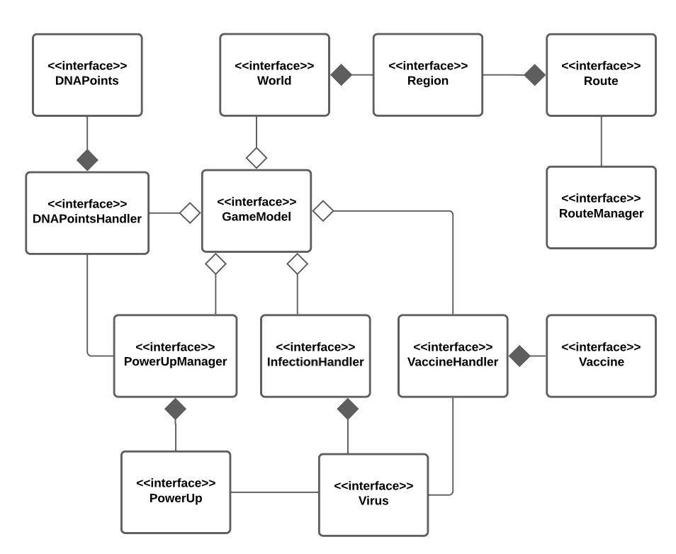

# Design Architetturale
Il software è stato progettato utilizzando il pattern architetturale Model-View-Controller (MVC), come rappresentato dallo schema in figura ???. 

  

Il Model contiene al suo interno tutti gli elementi cardine del dominio applicativo esplorato in precedenza, come ad esempio il mondo di gioco e le regioni, il virus, il vaccino, i potenziamenti e i DNA Points. La progettazione e implementazione di tutti gli elementi precedentemente citati verranno descritti e approfonditi nei successivi capitoli.

La View ha l'obbiettivo di fornire all'utente un'interfaccia grafica tramite la quale sia possibile effettuare delle partite e di conseguenza interagire con il sistema.

Il Controller ha infine il compito di legare assieme Model e View in modo da aggiornare le entità presenti nel Model a seguito di interazioni effettuate dall'utente con il sistema e viceversa aggiornare la View a seguito dei cambiamenti che si verificano con l'avanzare del gioco.

Inoltre si è deciso di evolvere l'architettura precedentemente descritta realizzando tre Controller differenti per mantenere una corretta suddivisione delle responsabilità. In particolare sono stati ideati i Controller seguenti: 
- **LauncherController**: si occupa di ricevere i dati inseriti dall'utente all'inizio della partita tramite la corrispondente LauncherView ed ha il compito di avviare l'esecuzione del gioco.
- **GameEngine**: rappresenta il Controller principale, si occupa della progressione del gioco ricevendo gli eventi generati dalla corrispondente GameView e aggiornandola a seguito di cambiamenti avvenuti nel Model, rappresenta di fatto un vero e proprio motore di gioco.
- **MenuController**: ha il compito di gestire l'interazione tra la MenuView e il Model, viene creato dal GameEngine ogni qualvolta un utente desidera interagire con il Menu di gioco.

  

Facendo riferimento alla figura ??? si noti che il Model risulta totalmente indipendente dal resto dell'architettura, di conseguenza viene utilizzato dai tre controller presenti che interagiscono con le rispettive View.
