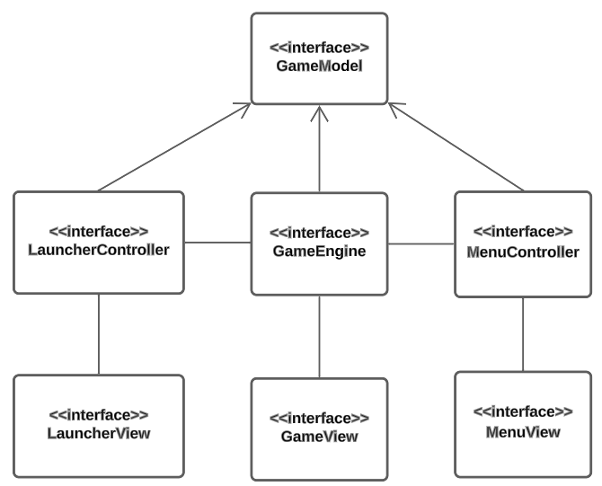

# Capitolo 3: Design Architetturale

## 3.1 Pattern Architetturale: MVC

Il software è stato progettato utilizzando il pattern architetturale Model-View-Controller (MVC), come rappresentato dallo schema in **figura 3.1**. 

  
  
<em>Figura 3.1: Diagramma dei package</em>

Il `Model` contiene al suo interno tutti gli elementi cardine del dominio applicativo esplorato in precedenza, come ad esempio il mondo di gioco e le regioni, il virus, il vaccino, i potenziamenti e i DNA Points. La progettazione e implementazione di tutti gli elementi precedentemente citati verranno descritti e approfonditi nei successivi capitoli.

La `View` ha l'obbiettivo di fornire all'utente un'interfaccia grafica tramite la quale sia possibile effettuare delle partite e di conseguenza interagire con il sistema.

Il `Controller` ha infine il compito di legare assieme Model e View in modo da aggiornare le entità presenti nel Model a seguito di interazioni effettuate dall'utente con il sistema e viceversa aggiornare la View a seguito dei cambiamenti che si verificano con l'avanzare del gioco.

Inoltre si è deciso di evolvere l'architettura precedentemente descritta realizzando tre Controller differenti per mantenere una corretta suddivisione delle responsabilità. In particolare sono stati ideati i Controller seguenti: 
- `LauncherController`: si occupa di ricevere i dati inseriti dall'utente all'inizio della partita tramite la corrispondente `LauncherView` ed ha il compito di avviare l'esecuzione del gioco.

- `GameEngine`: rappresenta il Controller principale, si occupa della progressione del gioco ricevendo gli eventi generati dalla corrispondente `GameView` e aggiornandola a seguito di cambiamenti avvenuti nel `GameModel`, rappresenta di fatto un vero e proprio motore di gioco.

- `MenuController`: ha il compito di gestire l'interazione tra la `MenuView` e il `GameModel`, viene creato dal `GameEngine` ogni qualvolta un utente desidera interagire con il Menu di gioco.

  
  
<em>Figura 3.2: Architettura nel dettaglio</em>

Facendo riferimento alla **figura 3.2** si noti che il `GameModel` viene quindi utilizzato da tutti e tre controller presenti che interagiscono inoltre con le rispettive View.

## 3.2 Comportamento dell'architettura

  
  
<em>Figura 3.3: Comportamento dell'architettura all'avvio del gioco</em>

In **figura 3.3** viene mostrato tramite un diagramma di sequenza il comportamento dell'architettura realizzata, all'avvio di PlagueDotScala. L'utente inizialmente interagisce con la `LauncherView` inserendo i dati richiesti per l'inizio di una nuova partita, in questo modo tramite il `LauncherController` è possibile istanziare la `GameView` che si occuperà della visualizzazione degli elementi di gioco principali e il `GameEngine` che regolerà la progressione del gioco.

  
  
<em>Figura 3.4: Comportamento dell'architettura all'apertura del menu di gioco</em>

Infine in **figura 3.4**, sempre utilizzando un diagramma di sequenza, viene mostrato il comportamento dell'architettura all'apertura del menu. L'utente interagisce inizialmente con la `GameView` per avviare la procedura di apertura del Menu di gioco, in questo caso è responsabilità del `GameEngine` avviare un'istanza del `MenuController` e della `MenuView` tramite il quale vengono abilitate le interazioni dell'utente con esso.
