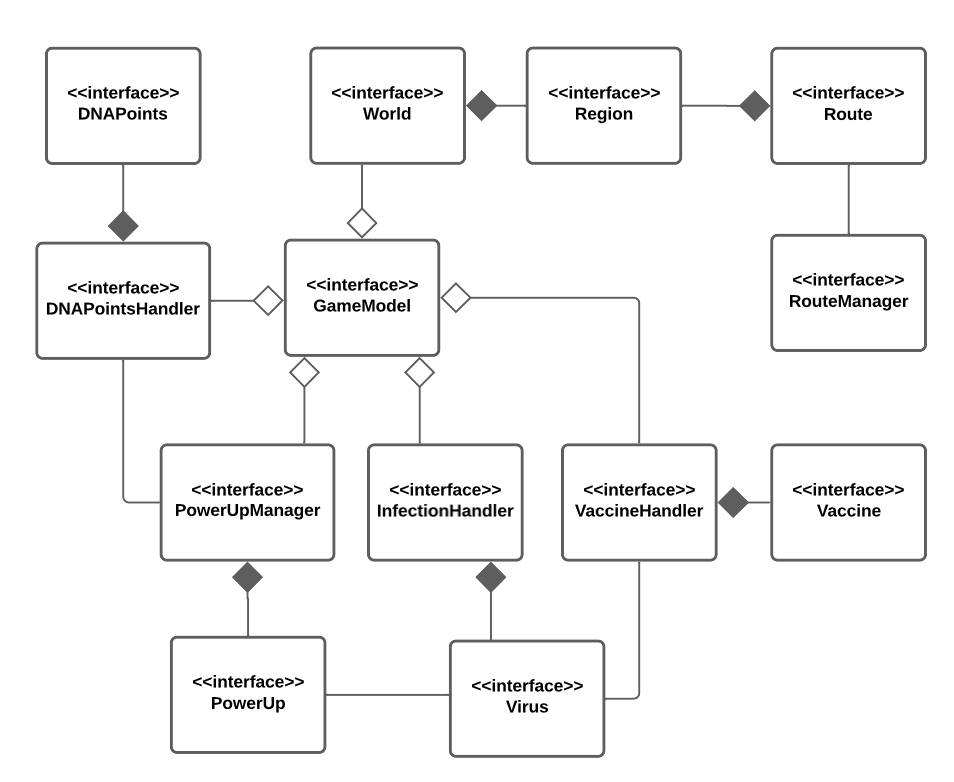

# Capitolo 4: Design di dettaglio

## Struttura del GameModel

  
  
<em>Figura 4.1: Diagramma del GameModel</em>

Come già anticipato il GameModel si compone di tutte le entità individuate durante l'analisi del modello di dominio, ovvero: `Virus`, `Vaccine`, `PowerUp`, `DNAPoint`, `Region`, `Route` e `World`.
Come mostrato in *figura 4.1* è stato deciso di progettare vari gestori che hanno l'obiettivo di rendere la gestione del dominio applicativo più versatile ed espandibile. In particolare sono quindi presenti: `InfectionHandler`, `VaccineHandler`, `DNAPointsHandler`, `PowerUpManager` e `RouteManager`.

## GameEngine: Il motore di gioco

Il `GameEngine` rappresenta il motore di gioco che si occupa della progressione della partita. 

Nello specifico contiene al suo interno il *gameLoop()* e ogni sua iterazione rappresenta un giorno trascorso all'interno del mondo di gioco.
Per ogni giornata il `GameEngine` ha il compito di utilizzare i gestori contenuti all'interno del `GameModel` per far progredire la partita, in particolare:
- Tramite l'`InfectionHandler` fa progredire l'infezione del virus.
- Utilizzando il `VaccineHandler` viene valutata la progressione della ricerca del vaccino.
- Con il `DNAPointsHandler` vengono generati i DNAPoints.

Il `GameEngine` valuta inoltre se la partita viene vinta oppure persa dall'utente gestendo in questo modo la logica di fine partita.

## Caricamento delle configurazioni di gioco
(Schema)

## Gestione del mondo di gioco

### Regions

Analizzando i requisiti dell'applicativo si nota che il mondo di gioco è costituito da un'insieme di regioni. Una peculiarità molto importante di una regione riguarda il fatto che oltre ad essere direttamente confinante con altre regioni, essa può possedere o meno un porto e un aeroporto che la connette a regioni non direttamente confinanti.

Facendo riferimento alla figura ??? si noti che questo requisito è stato modellato con l'utilizzo di **Mixin**. In particolare è stata realizzata una classe astratta `Region` che contiene al suo interno tutti i parametri comuni alle regioni (Nome, Popolazione, Clima ecc.) e memorizza inoltre le regioni direttamente confinanti e il numero di infetti.
Si noti inoltre che la classe astratta `Region` contiene un metodo astratto *getReachableRegions()* che verrà implementato in maniera differente a seconda del tipo di regione che si sta considerando. 

Scendendo nella gerarchia si notano due **trait** ovvero `Port` e `Airport` che hanno il ruolo di **Mixin**. Essi estendono la classe `Region` e implementano il metodo precedentemente citato *getReachableRegions()* aggiungendo le regioni raggiungibili tramite Porti e Aeroporti, facendo uso rispettivamente del `PortRouteManager` e dell' `AirportRouteManager`.

L'ultimo componente necessario per far uso di questa gerarchia è la classe `BasicRegion` che estende la classe astratta `Region` ma senza aver integrato alcun Mixin, essa rappresenta infatti l'implementazione base di una regione che non possiede ne porti ne aeroporti.

A questo punto risulta facilmente progettabile il concetto di regione con porto e/o aeroporto, essa dovrà infatti semplicemente estendere la `BasicRegion` e i Mixin di cui necessita in base alla sua tipologia. 

Questo approccio può essere visto come una sorta di **Decorator** in quanto presenta gli stessi vantaggi a livello di possibile espansione della logica di gioco, ad esempio se si rendesse necessario introdurre nuove possibilità di interconnessione tra regioni (come l'introduzione delle linee ferroviarie) i Mixin ne faciliterebbero l'introduzione e la combinazione con gli approcci di collegamento già presenti.

### Routes e RouteManager

### World
(World con filtri, gerarchia regioni, rotte (Singleton))
(Schema)

## Gestione dell'infezione
(Schema)

## Ricerca del Vaccino

Per quanto riguarda il vaccino, come già mostrato, si è pensato di realizzare un'entità denominata `VaccineHandler` che ha lo scopo di facilitarne la gestione da parte del `GameEngine` e di renderne eventuali modifiche o espansioni semplici da attuare. 

In questa parte è stato sfruttato il pattern di progettazione **Strategy**. Si noti infatti che è stata definita una `VaccineLogic` come **trait**, essa espone due metodi astratti *canResearchStart()* e *researchStep()*, essi verranno implementati da tutte le eventuali logiche per la ricerca del vaccino, definendone di conseguenza il comportamento.

In questa versione di PlagueDotScala si è resa necessaria solamente una logica di base ed è definita all'interno di `BasicVaccineLogic`, ma risulta immediata la progettazione di logiche più complesse, semplicemente estendendo `VaccineLogic` e implementando i suoi metodi.

Nella `BasicVaccineLogic` il metodo  *canResearchStart()* definisce se la ricerca del vaccino può iniziare, in base al numero di infetti globale, mentre *researchStep()* effettua uno step di ricerca, tenendo però conto di eventuali rallentamenti dovuti alla resistenza al vaccino del virus.

Il pattern **Strategy** è stato sfruttato nel `VaccineHandler` in quanto esso utilizza al suo interno una `VaccineLogic` che gli viene passata dall'esterno e ne utilizza i metodi definiti nel trait, ma la strategia della logica di ricerca dipende dalla tipologia di istanza passata (in questo caso `BasicVaccineLogic`).

## Potenziamenti
(PowerUp, PowerUpManager)
(Schema)

## DNAPoint
(Schema)

## GameView

## MenuView

## LauncherView
