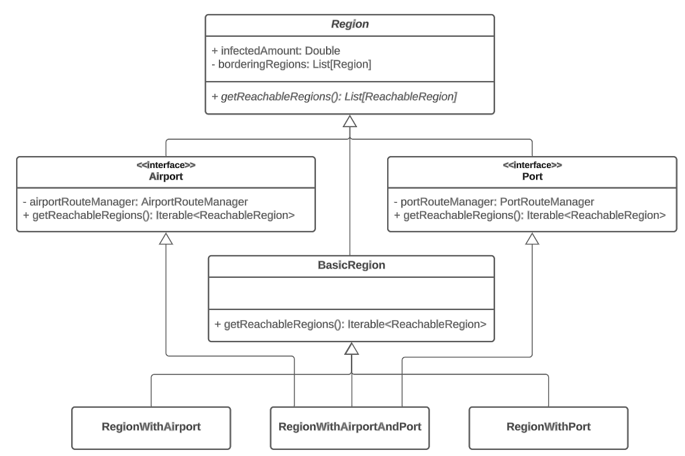

# Capitolo 4: Design di dettaglio

## Struttura del GameModel

  
  
<em>Figura 4.1: Diagramma del GameModel</em>

Come già anticipato il GameModel si compone di tutte le entità individuate durante l'analisi del modello di dominio, ovvero: `Virus`, `Vaccine`, `PowerUp`, `DNAPoint`, `Region`, `Route` e `World`.
Come mostrato in *figura 4.1* è stato deciso di progettare vari gestori che hanno l'obiettivo di rendere la gestione del dominio applicativo più versatile ed espandibile. In particolare sono quindi presenti: `InfectionHandler`, `VaccineHandler`, `DNAPointsHandler`, `PowerUpManager` e `RouteManager`.

## GameEngine: Il motore di gioco

Il `GameEngine` rappresenta il motore di gioco che si occupa della progressione della partita. 

Nello specifico contiene al suo interno il *gameLoop()* e ogni sua iterazione rappresenta un giorno trascorso all'interno del mondo di gioco.
Per ogni giornata il `GameEngine` ha il compito di utilizzare i gestori contenuti all'interno del `GameModel` per far progredire la partita, in particolare:
- Tramite l'`InfectionHandler` fa progredire l'infezione del virus.
- Utilizzando il `VaccineHandler` viene valutata la progressione della ricerca del vaccino.
- Con il `DNAPointsHandler` vengono generati i DNAPoints.

Il `GameEngine` valuta inoltre se la partita viene vinta oppure persa dall'utente gestendo in questo modo la logica di fine partita.

## Caricamento delle configurazioni di gioco

Durante la fase di analisi del dominio, abbiamo notato che diversi elementi di gioco, tra i quali rotte, regioni e virus, sono costituiti da una lunga serie di parametri,
pertanto ci è sembrata fin da subito la scelta più conveniente rappresentare tali elementi sottoforma di file di testo in modo da rendere la configurazione di gioco
indipendente dalla logica applicativa. Ogni elemento di gioco che può essere caricato dinamicamente ha associato ad esso un `ConfigurationFile`, un `Parser` ed un
`ConfigurationBuilder`.

  
  
<em>Figura 4.??: Caricamento delle configurazione di gioco, diagramma delle classi</em>

Il `Parser` è l'entità che si occupa di convertire una stringa rappresentante un elemento di gioco, nell'elemento di gioco stesso.
Per rendere questo possibile, nel metodo *parse* di ogni `Parser` è utilizzato un `ConfigurationBuilder` del suo stesso tipo
(es. `RegionParser` e `RegionBuilder`). Una volta interpretata l'intera stringa, il `Parser` restituisce un opzionale contenente
l'oggetto convertito nel caso in cui tutti i campi obbligatori siano stati settati, o un'opzionale vuoto se uno o più campi non sono stati
correttamente settati perchè mancanti o aventi valori non ammissibili.

Un file di configurazione può essere convertito in una serie di oggetti attraverso il metodo *load* del `ConfigurationLoader`.
Per ogni riga non commentata del file, è invocato il metodo *parse* del `Parser` corrispondente al file di configurazione passato.
Il risultato consiste in una lista contentente solamente gli oggetti correttamente convertiti.

Sebbene sia possibile richiamare direttamente il metodo *load*, la classe `ConfigurationLoader` mette a disposizione due ulteriori metodi che permettono di ottenere oggetti già pronti per l'uso:
- il metodo *loadWorld* permette di caricare regioni e rotte in una sola operazione, restituendo un oggetto `World` contenente tutte le regioni correttamente convertite;
- il metodo *loadVirus* restituisce un opzionale contenente un singolo oggetto `Virus` o vuoto se nessuna riga del file di configurazione è stata correttamente convertita.

## Gestione del mondo di gioco

### Regions

Analizzando i requisiti dell'applicativo si nota che il mondo di gioco è costituito da un'insieme di regioni. Una peculiarità molto importante di una regione riguarda il fatto che oltre ad essere direttamente confinante con altre regioni, essa può possedere o meno un porto e un aeroporto che la connette a regioni non direttamente confinanti.

  
  
<em>Figura 3.1: Gerarchia delle regioni con Mixin</em>

Facendo riferimento alla figura ??? si noti che questo requisito è stato modellato con l'utilizzo di **Mixin**. In particolare è stata realizzata una classe astratta `Region` che contiene al suo interno tutti i parametri comuni alle regioni (Nome, Popolazione, Clima ecc.) e memorizza inoltre le regioni direttamente confinanti e il numero di infetti.
Si noti inoltre che la classe astratta `Region` contiene un metodo astratto *getReachableRegions()* che verrà implementato in maniera differente a seconda del tipo di regione che si sta considerando. 

Scendendo nella gerarchia si notano due **trait** ovvero `Port` e `Airport` che hanno il ruolo di **Mixin**. Essi estendono la classe `Region` e implementano il metodo precedentemente citato *getReachableRegions()* aggiungendo le regioni raggiungibili tramite Porti e Aeroporti, facendo uso rispettivamente del `PortRouteManager` e dell' `AirportRouteManager`.

L'ultimo componente necessario per far uso di questa gerarchia è la classe `BasicRegion` che estende la classe astratta `Region` ma senza aver integrato alcun Mixin, essa rappresenta infatti l'implementazione base di una regione che non possiede ne porti ne aeroporti.

A questo punto risulta facilmente progettabile il concetto di regione con porto e/o aeroporto, essa dovrà infatti semplicemente estendere la `BasicRegion` e i Mixin di cui necessita in base alla sua tipologia. 

Questo approccio può essere visto come una sorta di **Decorator** in quanto presenta gli stessi vantaggi a livello di possibile espansione della logica di gioco, ad esempio se si rendesse necessario introdurre nuove possibilità di interconnessione tra regioni (come l'introduzione delle linee ferroviarie) i Mixin ne faciliterebbero l'introduzione e la combinazione con gli approcci di collegamento già presenti.

### World

A questo punto si rende necessaria un'entità che contenga l'insieme delle regioni appartenenti al mondo di gioco e fornisca un modo rapido e compatto per accedervi.
Si è pensato quindi di progettare un'entità `World` che contiene al suo interno la lista di tutte le regioni presenti. `World` espone un metodo chiamato *getRegions(using filter: RegionFilter)* che restituisce un insieme di regioni in base al filtro specificato e mette a disposizione un insieme di filtri che si comportano come segue:

- `infectedRegions` : individua solamente le regioni infette.
- `notInfectedRegions` : individua solamente le regioni non infette.
- `totallyInfectedRegions` : individua solamente le regioni completamente infette.
- `infectedButNotCompletelyRegions` : individua solamente le regioni infette ma non completamente.

Si è pensato al tipo `RegionFilter` come `Region`=>`Boolean`, di conseguenza sarà possibile specificare un qualsiasi filtro personalizzato che rispetti questa struttura, anche se non presente tra quelli già forniti. Inoltre si è pensato di progettare il metodo sopra citato in modo da restituire la lista completa di tutte le regioni, in caso non venga specificato alcun filtro. Queste peculiarità rendono la struttura del mondo di gioco versatile e facilmente estendibile.

### Routes e RouteManager

Una volta reso possibile configurare le regioni abilitando porti e aeroporti, si rende necessaria una logica per la gestione dei collegamenti tra di esse. Si è pensato di progettare un entità `Route` che possiede il riferimento a due regioni che sono collegate e contiene inoltre la modalità con cui sono connesse (rappresentata dall'enumerazione `ReachableMode`): 

- `ReachableMode.Border` : per le regioni direttamente confinanti.
- `ReachableMode.Airport` : per le regioni collegate tramite aeroporto.
- `ReachableMode.Port` : per le regioni collegate tramite porto.

  
  
<em>Figura 4.1: Route e gerarchia dei RouteManager</em>

Inoltre come viene evidenziato dalla figura ??? anche per la gestione delle rotte è stata progettata un'entità, in questo caso denominata `RouteManager`. L'idea è di avere all'interno dell'applicativo un'unica istanza di un gestore per le rotte portuali ovvero un `PortRouteManager` e allo stesso modo un'unica istanza di un gestore di rotte aeroportuali quindi un `AirportRouteManager`.

Inanzitutto è stata realizzata una gerarchia con alla radice il `RouteManager` come classe astratta, esso incorpora gli aspetti che un gestore di rotte deve necessariamente avere, come la lista di tutte le rotte e la possibilità di fornire le rotte disponibili a partire da una regione. Successivamente sono stati pensati come **trait** il `PortRouteManager` e l' `AirportRouteManager` che estendono il `RouteManager` di base.

In questo caso data la necessità di ottenere una sola entità per entrambi è stato utilizzato il pattern di progettazione **Singleton**. Inoltre per rispettare l' **Open-Closed Principle** è stato deciso di mantenere l'implementazione di entrambi i **trait** come privata utilizzando i rispettivi Companion Objects. 

Entrambe le implementazioni si occuperanno di definire il comportamento del metodo astratto *addRoute(fromRegion: Region, toRegion: Region)* contenuto all'interno di `RouteManager`, in modo da permettere al `PortRouteManager` di poter aggiungere e gestire solamente le rotte portuali e allo stesso modo rendendo l'`AirportRouteManager` responsabile di quelle aeroportuali.

## Gestione dell'infezione
(Schema)

## Ricerca del Vaccino

Per quanto riguarda il vaccino, come già mostrato, si è pensato di realizzare un'entità denominata `VaccineHandler` che ha lo scopo di facilitarne la gestione da parte del `GameEngine` e di renderne eventuali modifiche o espansioni semplici da attuare. 

  
  
<em>Figura 3.1: Design di dettaglio per la gestione del vaccino</em>

In questa parte è stato sfruttato il pattern di progettazione **Strategy**. Si noti infatti che è stata definita una `VaccineLogic` come **trait**, essa espone due metodi astratti *canResearchStart()* e *researchStep()*, essi verranno implementati da tutte le eventuali logiche per la ricerca del vaccino, definendone di conseguenza il comportamento.

In questa versione di PlagueDotScala si è resa necessaria solamente una logica di base ed è definita all'interno di `BasicVaccineLogic`, ma risulta immediata la progettazione di logiche più complesse, semplicemente estendendo `VaccineLogic` e implementando i suoi metodi.

Nella `BasicVaccineLogic` il metodo  *canResearchStart()* definisce se la ricerca del vaccino può iniziare, in base al numero di infetti globale, mentre *researchStep()* effettua uno step di ricerca, tenendo però conto di eventuali rallentamenti dovuti alla resistenza al vaccino del virus.

Il pattern **Strategy** è stato sfruttato nel `VaccineHandler` in quanto esso utilizza al suo interno una `VaccineLogic` che gli viene passata dall'esterno e ne utilizza i metodi definiti nel trait, ma la strategia della logica di ricerca dipende dalla tipologia di istanza passata (in questo caso `BasicVaccineLogic`).

## Potenziamenti
 
### PowerUp (Anche PowerUpType ecc.)

### PowerUpManager

Come già anticipato, anche per la gestione dei PowerUp è stata realizzata un'entità dedicata ovvero il `PowerUpManager`. Al suo interno contiene la lista di tutti i PowerUp disponibili in PlagueDotScala ed espone vari metodi per permetterne l'accesso. Nello specifico:

- *getAllPowerUps()*: restituisce la lista completa di tutti i PowerUp.
- *getPurchasablePowerUps()*: restituisce la lista dei soli PowerUp acquistabili.
- *getPurchasedPowerUps()*: restituisce la lista di tutti i PowerUp già acquistati.
- *getPowerUp(powerUpType: PowerUpType)*: restituisce il PowerUp che corrisponde al tipo specificato, se presente.

Una delle responsabilità principali del `PowerUpManager` quando deve fornire i PowerUp acquistabili, è verificare se i prerequisiti sono soddisfatti. Come già descritto i PowerUp hanno un'organizzazione gerarchica che stabilisce la possibilità di acquistare un determinato PowerUp solamente se quelli da cui dipende sono già stati acquistati e ovviamente se si possiedono sufficienti `DNAPoints`. A livello di progettazione si è pensato di includere questo comportamento all'interno del metodo chiamato *arePrerequisiteSatisfied(powerUp: PowerUp)*.

Un'altra importante funzione del `PowerUpManager` riguarda l'acquisto dei PowerUp...

## DNAPoint
(Schema)

## GameView

## MenuView

## LauncherView
