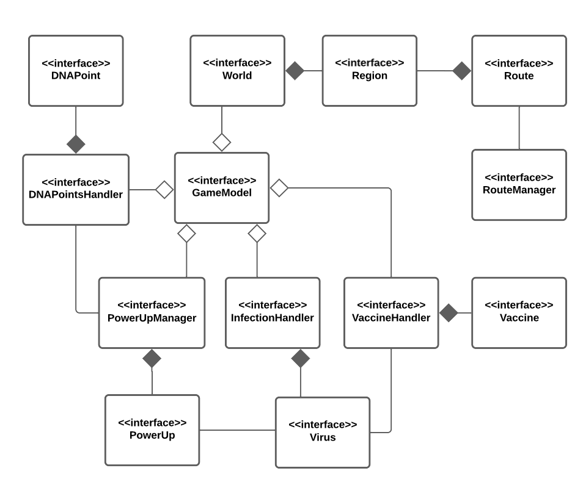
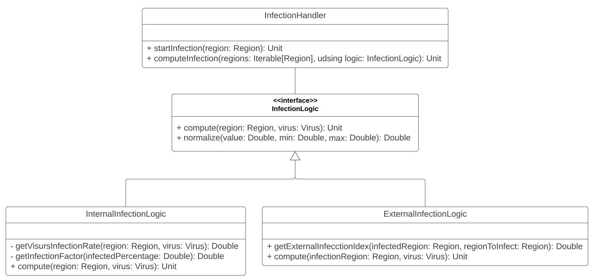
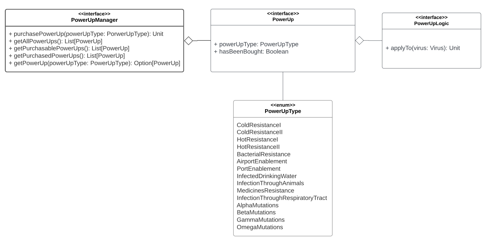

# Capitolo 4: Design di dettaglio

## 4.1 Struttura del GameModel

  
  
<em>Figura 4.1: Diagramma del GameModel</em>

Come già anticipato il GameModel si compone di tutte le entità individuate durante l'analisi del modello di dominio, ovvero: `Virus`, `Vaccine`, `PowerUp`, `DNAPoint`, `Region`, `Route` e `World`.
Come mostrato in *figura 4.1* è stato deciso di progettare vari gestori che hanno l'obiettivo di rendere la gestione del dominio applicativo più versatile ed espandibile. In particolare sono quindi presenti: `InfectionHandler`, `VaccineHandler`, `DNAPointsHandler`, `PowerUpManager` e `RouteManager`.

## 4.2 GameEngine: Il motore di gioco

Il `GameEngine` rappresenta il motore di gioco che si occupa della progressione della partita. 

Nello specifico contiene al suo interno il *gameLoop()* e ogni sua iterazione rappresenta un giorno trascorso all'interno del mondo di gioco.
Per ogni giornata il `GameEngine` ha il compito di utilizzare i gestori contenuti all'interno del `GameModel` per far progredire la partita, in particolare:
- Tramite l'`InfectionHandler` fa progredire l'infezione del virus.
- Utilizzando il `VaccineHandler` viene valutata la progressione della ricerca del vaccino.
- Con il `DNAPointsHandler` vengono generati i DNAPoints.

Il `GameEngine` valuta inoltre se la partita viene vinta oppure persa dall'utente gestendo in questo modo la logica di fine partita.

## 4.3 Caricamento delle configurazioni di gioco

Durante la fase di analisi del dominio, abbiamo notato che diversi elementi di gioco, tra i quali rotte, regioni e virus, sono costituiti da una lunga serie di parametri,
pertanto ci è sembrata fin da subito la scelta più conveniente rappresentare tali elementi sotto forma di file di testo in modo da rendere la configurazione di gioco
indipendente dalla logica applicativa. Ogni elemento di gioco che può essere caricato dinamicamente ha associato ad esso un `ConfigurationFile`, un `Parser` ed un
`ConfigurationBuilder`.

  
  
<em>Figura 4.??: Caricamento delle configurazione di gioco, diagramma delle classi</em>

Il `Parser` è l'entità che si occupa di convertire una stringa rappresentante un elemento di gioco, nell'elemento di gioco stesso.
Per rendere questo possibile, nel metodo *parse* di ogni `Parser` è utilizzato un `ConfigurationBuilder` del suo stesso tipo
(es. `RegionParser` e `RegionBuilder`). Una volta interpretata l'intera stringa, il `Parser` restituisce un opzionale contenente
l'oggetto convertito nel caso in cui tutti i campi obbligatori siano stati settati, o un'opzionale vuoto se uno o più campi non sono stati
correttamente settati perchè mancanti o aventi valori non ammissibili.

Un file di configurazione può essere convertito in una serie di oggetti attraverso il metodo *load* del `ConfigurationLoader`.
Per ogni riga non commentata del file, è invocato il metodo *parse* del `Parser` corrispondente al file di configurazione passato.
Il risultato consiste in una lista contentente solamente gli oggetti correttamente convertiti.

Sebbene sia possibile richiamare direttamente il metodo *load*, la classe `ConfigurationLoader` mette a disposizione due ulteriori metodi che permettono di ottenere oggetti già pronti per l'uso:
- il metodo *loadWorld* permette di caricare regioni e rotte in una sola operazione, restituendo un oggetto `World` contenente tutte le regioni correttamente convertite;
- il metodo *loadVirus* restituisce un opzionale contenente un singolo oggetto `Virus` o vuoto se nessuna riga del file di configurazione è stata correttamente convertita.

## 4.4 Gestione del mondo di gioco

### Region

Analizzando i requisiti dell'applicativo si nota che il mondo di gioco è costituito da un'insieme di regioni. Una peculiarità molto importante di una regione riguarda il fatto che oltre ad essere direttamente confinante con altre regioni, essa può possedere o meno un porto e un aeroporto che la connette a regioni non direttamente confinanti.

  
  
<em>Figura 3.1: Gerarchia delle regioni con Mixin</em>

Facendo riferimento alla figura ??? si noti che questo requisito è stato modellato con l'utilizzo di **Mixin**. In particolare è stata realizzata una classe astratta `Region` che contiene al suo interno tutti i parametri comuni alle regioni (Nome, Popolazione, Clima ecc.) e memorizza inoltre le regioni direttamente confinanti e il numero di infetti.
Si noti inoltre che la classe astratta `Region` contiene un metodo astratto *getReachableRegions()* che verrà implementato in maniera differente a seconda del tipo di regione che si sta considerando. 

Scendendo nella gerarchia si notano due **trait** ovvero `Port` e `Airport` che hanno il ruolo di **Mixin**. Essi estendono la classe `Region` e implementano il metodo precedentemente citato *getReachableRegions()* aggiungendo le regioni raggiungibili tramite Porti e Aeroporti, facendo uso rispettivamente del `PortRouteManager` e dell' `AirportRouteManager`, la cui progettazione verrà discussa in seguito.

L'ultimo componente necessario per far uso di questa gerarchia è la classe `BasicRegion` che estende la classe astratta `Region` ma senza aver integrato alcun Mixin, essa rappresenta infatti l'implementazione base di una regione che non possiede ne porti ne aeroporti.

A questo punto risulta facilmente progettabile il concetto di regione con porto e/o aeroporto, essa dovrà infatti semplicemente estendere la `BasicRegion` e i Mixin di cui necessita in base alla sua tipologia. In questo modo ad esempio il metodo *getReachableRegions()* di una `RegionWithPort` restituirà non solo le regioni direttamente confinanti, ma anche quelle collegate attraverso il porto, ottenute utilizzando il `PortRouteManager`.

Questo approccio può essere visto come una sorta di **Decorator** in quanto presenta gli stessi vantaggi a livello di possibile espansione della logica di gioco, ad esempio se si rendesse necessario introdurre nuove possibilità di interconnessione tra regioni (come l'introduzione delle linee ferroviarie) i Mixin ne faciliterebbero la progettazione e la combinazione con gli approcci di collegamento già presenti.

### World

A questo punto si rende necessaria un'entità che contenga l'insieme delle regioni appartenenti al mondo di gioco e fornisca un modo rapido e compatto per accedervi.
Si è pensato quindi di progettare un'entità `World` che contiene al suo interno la lista di tutte le regioni presenti. `World` espone un metodo chiamato *getRegions(using filter: RegionFilter)* che restituisce un insieme di regioni in base al filtro specificato e mette a disposizione un insieme di filtri che si comportano come segue:

- `infectedRegions` : individua solamente le regioni infette.
- `notInfectedRegions` : individua solamente le regioni non infette.
- `totallyInfectedRegions` : individua solamente le regioni completamente infette.
- `infectedButNotCompletelyRegions` : individua solamente le regioni infette ma non completamente.

Si è pensato al tipo `RegionFilter` come `Region`=>`Boolean`, di conseguenza sarà possibile specificare un qualsiasi filtro personalizzato che rispetti questa struttura, anche se non presente tra quelli già forniti. Inoltre si è pensato di progettare il metodo sopra citato in modo da restituire la lista completa di tutte le regioni, in caso non venga specificato alcun filtro. Queste peculiarità rendono la struttura del mondo di gioco versatile e facilmente estendibile.

### Route e RouteManager

Una volta reso possibile configurare le regioni abilitando porti e aeroporti, si rende necessaria una logica per la gestione dei collegamenti tra di esse. Si è pensato di progettare un entità `Route` che possiede il riferimento alle due regioni che sono collegate e contiene inoltre la modalità con cui sono connesse (rappresentata dall'enumerazione `ReachableMode`): 

- `ReachableMode.Border` : per le regioni direttamente confinanti.
- `ReachableMode.Airport` : per le regioni collegate tramite aeroporto.
- `ReachableMode.Port` : per le regioni collegate tramite porto.

  
  
<em>Figura 4.1: Route e gerarchia dei RouteManager</em>

Inoltre come viene evidenziato dalla figura ??? anche per la gestione delle rotte è stata progettata un'entità, in questo caso denominata `RouteManager`. L'idea è di avere all'interno dell'applicativo un'unica istanza di un gestore per le rotte portuali ovvero un `PortRouteManager` e allo stesso modo un'unica istanza di un gestore di rotte aeroportuali quindi un `AirportRouteManager`.

Inanzitutto è stata realizzata una gerarchia con alla radice il `RouteManager` come classe astratta, esso incorpora gli aspetti che un gestore di rotte deve necessariamente avere, come la lista di tutte le rotte e la possibilità di fornire le rotte disponibili a partire da una regione. Successivamente sono stati pensati come **trait** il `PortRouteManager` e l' `AirportRouteManager` che estendono il `RouteManager` di base.

In questo caso data la necessità di ottenere una sola entità per entrambi è stato utilizzato il pattern di progettazione **Singleton**. Inoltre per rispettare l' **Open-Closed Principle** è stato deciso di mantenere l'implementazione di entrambi i **trait** come privata utilizzando i rispettivi Companion Objects. 

Entrambe le implementazioni si occuperanno di definire il comportamento del metodo astratto *addRoute(fromRegion: Region, toRegion: Region)* contenuto all'interno di `RouteManager`, in modo da permettere al `PortRouteManager` di poter aggiungere e gestire solamente le rotte portuali e allo stesso modo rendendo l'`AirportRouteManager` responsabile di quelle aeroportuali.

## 4.5 Gestione dell'infezione

  
  
<em>Figura 4.?: Design di dettaglio per la gestione dell'infezione</em>

L’infezione del virus costituisce il meccanismo mediante il quale il virus si diffonde all'interno dell'ambiente di gioco nel corso del tempo. Questa complessa dinamica è gestita da un `InfectionHandler`, il quale si occupa di avviare la propagazione del virus in una specifica regione scelta dall'utente e di calcolare l'incremento del numero di individui infetti.

Nel metodo *computeInfection()* è stato deciso di utilizzare il meccanismo di scala avanzato **given**, permettendo di determinare una procedura standard di esecuzione (`InternalInfectionLogic`) nel caso in cui non ne venisse esplicitamente richiesta una diversa.

In questa parte del progetto, è stato utilizzato il pattern di progettazione **Strategy** con la trait `InfectionLogic`. Questa trait espone un metodo **compute()*** non implementato, che verrà concretizzato dalle diverse logiche di infezione per determinare l'avanzamento della diffusione del virus. Il pattern **Strategy** ha permesso di separare la logica di infezione dall'implementazione concreta, ottenendo un sistema più modulare e flessibile.

La logica di diffusione del virus si suddivide in due parti distinte: `InternalInfectionLogic` ed `ExternalInfectionLogic`.

`InternalInfectionLogic`: Questa parte determina il modo in cui il virus si diffonde all'interno di una data regione, considerando le caratteristiche infettive del virus e la tipologia di tale area. 
A seguito vengono riportati I metodi privati utilizzati per raggiungere questo obiettivo.

- **getRichRegionInfectivityIndex(regionRichness: Int, richRegionsInfectivity: Int)**: Questo metodo calcola un indice di infettività per le regioni caratterizzate da un elevato livello di ricchezza.
- **getPoorRegionInfectivityIndex(regionRichness: Int, poorRegionsInfectivity: Int)**: Analogamente al metodo precedente, calcola l'indice di infettività per le regioni svantaggiate economicamente.   
- **getColdRegionInfectivityIndex(climate: Int, coldRegionsInfectivity)**: Questo metodo determina l'indice di infettività per le regioni caratterizzate da un clima freddo.
- **getHotRegionInfectivityIndex(climate: Int, hotRegionsInfectivity)**: Similmente al metodo precedente, questo calcola l'indice di infettività per le regioni caratterizzate da un clima caldo.
- **getLowDensityRegionInfectivityIndex(populationDensity: Unit, lowDensityRegionInfectivity)**: Questo metodo valuta l'indice di infettività per le regioni con una bassa densità di popolazione.
- **getHighDensityRegionInfectivityIndex(populationDensity: Unit, highDensityRegionInfectivity)**: Similmente al metodo precedente, questo calcola l'indice di infettività per le Regioni con una alta densità di popolazione.

Successivamente, questi indici di infettività vengono elaborati e la loro media viene calcolata mediante il metodo **getVirusInfectionRate()**. Inoltre, il metodo **GetInfectionFactor()** è responsabile di regolare la curva di crescita del numero di individui infetti all'interno di una determinata regione, aumentando o diminuendo la velocità di propagazione in base alla percentuale di individui già infetti presenti. Il calcolo ottenuto verrà poi combinato con la media degli indici calcolati precedentemente per determinare l'aumento effettivo del numero di individui infetti all'interno della regione considerata.

`ExternalInfectionLogic`: è responsabile dell'implementazione della logica di diffusione del virus tra le regioni confinanti. Un aspetto cruciale di questa logica è il metodo denominato **getExternalInfectionIndex()**, il quale consente di ottenere un indice di infezione quando si considera una regione infetta e una sana. Questo indice svolge un ruolo chiave nel processo decisionale eseguito dal metodo compute, il quale stabilisce se la Regione sana debba essere infettata o meno. Di conseguenza, ciò comporta un incremento di un unità nel numero complessivo degli individui infetti, preparando la regione infetta ad essere gestita successivamente anche dalla logica di `InternalInfectionLogic` per quanto riguarda la diffusione del virus al suo interno.
Per determinare se una regione sana debba essere infettata, viene applicata una specifica logica. Innanzitutto, è essenziale che le due regioni siano confinanti fisicamente o, alternativamente, possano essere collegate tramite rotte di porti o aeroporti (ovviamente, nel contesto del gioco, è fondamentale che gli spostamenti attraverso queste due tipologie di collegamenti siano abilitati). Successivamente, l'indice di infezione calcolato in precedenza viene impiegato in modo da agire come un criterio discriminante. Quando questo indice raggiunge il valore di 1, viene scatenata l'infezione nella regione sana, portando così alla trasformazione della regione in una regione infetta.

## 4.6 Ricerca del Vaccino

Per quanto riguarda il vaccino, come già mostrato, si è pensato di realizzare un'entità denominata `VaccineHandler` che ha lo scopo di facilitarne la gestione da parte del `GameEngine` e di renderne eventuali modifiche o espansioni semplici da attuare. 

  
  
<em>Figura 3.1: Design di dettaglio per la gestione del vaccino</em>

In questa parte è stato sfruttato il pattern di progettazione **Strategy**. Si noti infatti che è stata definita una `VaccineLogic` come **trait**, essa espone due metodi astratti *canResearchStart()* e *researchStep()*, essi verranno implementati da tutte le eventuali logiche per la ricerca del vaccino, definendone di conseguenza il comportamento.

In questa versione di PlagueDotScala si è resa necessaria solamente una logica di base ed è definita all'interno di `BasicVaccineLogic`, ma risulta immediata la progettazione di logiche più complesse, semplicemente estendendo `VaccineLogic` e implementando i suoi metodi.

Nella `BasicVaccineLogic` il metodo  *canResearchStart()* definisce se la ricerca del vaccino può iniziare, in base al numero di infetti globale, mentre *researchStep()* effettua uno step di ricerca, tenendo però conto di eventuali rallentamenti dovuti alla resistenza al vaccino del virus.

Il pattern **Strategy** è stato sfruttato nel `VaccineHandler` in quanto esso utilizza al suo interno una `VaccineLogic` che gli viene passata dall'esterno e ne utilizza i metodi definiti nel trait, ma la strategia della logica di ricerca dipende dalla tipologia di istanza passata (in questo caso `BasicVaccineLogic`).

## 4.7 DNAPoint

  
  
<em>Figura ???: Design di dettaglio per la gestione dei DNA point</em>

I `DnaPoint` sono stati pensati come entità collezionabili, attraverso i quali è possibile acquistare potenziamenti. La gestione
dei `DnaPoint` è interamente affidata al `DnaPointHandler`, il quale incapsula al suo interno la logica di spawn come da pattern
**Strategy**. Al momento della creazione del `DnaPointHandler` è infatti chiesto di specificare la `SpawnPointLogic` da utilizzare. 

La valutazione della logica è effettuata in seguito al metodo *computeDnaPointSpawn* del `DnaPointHandler`, che al suo interno richiama 
il metodo *evaluate* della `SpawnPointLogic`. Il metodo *evaluate* non crea i veri e propri `DnaPoint`, bensì restituisce un insieme di regioni nelle quali
spawnare i `DnaPoint`. Per ogni regione restituita, il `DnaPointHandler` richiama il metodo *spawnDnaPoint* che genera il `DnaPoint` nella regione
specificata e notifica tutti i `DnaPointSpawnObserver` in ascolto. Il pattern **Observer** è utilizzato per aggiornare la grafica al momento e mostrare sulla
mappa un pulsante corrispondente al `DnaPoint` appena creato.

Utilizzando il meccanismo dei **Mixin** sono state realizzate diverse logiche di spawn:
- `EmptyLogic`: il metodo *evaluate* restituisce sempre un insieme vuoto, pertanto lo spawn di nuovi DnaPoint non è possibile;
- `OnNewInfectedRegionsLogic`: il metodo *evaluate* restituisce le regioni infette che al momento della precedente valutazione erano sane; 
- `EveryXSecondsLogic`: il metodo *evaluate* restituisce una regione casuale tra quelle infette;
- `BasicLogic`: è un unione delle logiche `OnNewInfectedRegionsLogic` e `EveryXSecondsLogic`.

## 4.8 Potenziamenti

  
  
<em>Figura 4.?:  Design di dettaglio per la gestione dei PowerUp</em>

### PowerUp 

Il progresso all'interno del gioco si basa sulla possibilità di acquisire PowerUp, che consentono di apportare modifiche alle caratteristiche di infettività del virus.
La classe PowerUp svolge un ruolo fondamentale, poiché contiene il riferimento alla tipologia specifica di PowerUp associato e tiene traccia se il PowerUp è stato già acquistato o meno.

Anche in questa parte del progetto è stato utilizzato il pattern di progettazione **Strategy** con la trait `PowerUpLogic`. Questa trait tramite il metodo **applyTo()** permette di modificare determinate caratteristiche del virus. Ogni tipologia di powerUp possiede una specifica logica di esecuzione.

All'interno del gioco, esistono diverse tipologie di PowerUp, le quali sono definite all'interno dell'enumerazione `PowerUpType`, che elenca tutte le opzioni disponibili. Ciascuna tipologia di PowerUp possiede diverse informazioni rilevanti:
- `price: Int` rappresenta il costo necessario per acquisire il PowerUp.
- `prerequisite: List[PowerUpType]` che può contenere una lista di `PowerUpType`; questa rappresenta una gerarchia di acquisto. Se l'utente non ha ancora acquistato i PowerUp indicati in questa lista, non sarà in grado di acquistare il PowerUp specificato.
- `logic: PowerUpLogic` si riferisce alla logica specifica del PowerUp, che determina come esso modificherà le proprietà del virus.
- `information: PowerUpInformation` contiene informazioni testuali che vengono utilizzate all'interno del gioco per mostrare all'utente gli effetti di ciascun PowerUp.

Il componente `PowerUpLogic` consente di apportare modifiche alle caratteristiche del virus in base alle specifiche del PowerUp. Per ogni tipo di PowerUp presente, viene associata una logica unica che determinerà come il PowerUp influenzerà le proprietà del virus.

### PowerUpManager

Come già anticipato, anche per la gestione dei PowerUp è stata realizzata un'entità dedicata ovvero il `PowerUpManager`. Al suo interno contiene la lista di tutti i PowerUp disponibili in PlagueDotScala ed espone vari metodi per permetterne l'accesso. Nello specifico:

- *getAllPowerUps()*: restituisce la lista completa di tutti i PowerUp.
- *getPurchasablePowerUps()*: restituisce la lista dei soli PowerUp acquistabili.
- *getPurchasedPowerUps()*: restituisce la lista di tutti i PowerUp già acquistati.
- *getPowerUp(powerUpType: PowerUpType)*: restituisce il PowerUp che corrisponde al tipo specificato, se presente.

Una delle responsabilità principali del `PowerUpManager` quando deve fornire i PowerUp acquistabili, è verificare se i prerequisiti sono soddisfatti. Come già descritto i PowerUp hanno un'organizzazione gerarchica che stabilisce la possibilità di acquistare un determinato PowerUp solamente se quelli da cui dipende sono già stati acquistati e ovviamente se si possiedono sufficienti `DNAPoints`. A livello di progettazione si è pensato di includere questo comportamento all'interno del metodo chiamato *arePrerequisiteSatisfied(powerUp: PowerUp)*.

Un'altra importante funzione del `PowerUpManager` riguarda l'acquisto dei PowerUp. È possibile acquistare un `PowerUp` attraverso
il metodo *purchasePowerUp* specificandone il suo tipo. Al momento dell'acquisto, il costo del PowerUp
è sottratto al saldo disponibile presente all'interno del `DnaPointsHandler`. Una volta acquistato, il PowerUp è applicato al Virus.
Per permettere ciò, sia il `PowerUpManager` che il `Virus` sono passati come argomenti del costruttore.

## 4.9 GameView

Questo componente costituisce la parte grafica più importante dell'intera applicazione in quanto permette di interagire con
la mappa del mondo e visualizzare lo stato di avanzamento del gioco. La grafica è aggiornata periodicamente, richiedendo le
informazioni utili al `GameEngine`, come precedentemente mostrato nella descrizione dell'architettura.

Gli elementi principali della `GameView` sono tre pannelli:
- `WorldMapPanel`: contiene una rappresentazione interagibile del mondo di gioco. Cliccando su una regione viene aggiornato il `RegionsPanel` e sono mostrati i dettagli della singola regione selezionata. Cliccando invece su una parte di mondo non contenente regioni, il `RegionsPanel` è aggiornato mostrando lo stato di avanzamento dell'infezione in tutte le regioni. Il `WorldMapPanel` è di fondamentale importanza poiché su di esso compaiono i DnaPoint, i quali possono essere raccolti cliccando sul pulsante corrispondente.
- `RegionsPanel`: questo pannello ha due diversi utilizzi. Come già anticipato, cliccando su una singola regione sono mostrate le caratteristiche della singola regione (numero di infetti, popolazione, clima, ricchezza...), mentre cliccando al di fuori delle regioni, è mostrata una progress bar per ogni regione che rappresenta la percentuale di infetti.
- `GeneralInfectionPanel`: questo pannello mostra la percentuale di popolazione del mondo infetta e lo stato di avanzamento di ricerca del vaccino attraverso due progress bar. È inoltre mostrato il numero di giorni trascorsi dall'inizio dell'infezione.

## 4.10 MenuView

Questo componente rappresenta la parte grafica legata al Menu di gioco e come già anticipato nella descrizione dell'architettura, comunica con il `MenuController`.
A livello di progettazione si è pensato di suddividere questo componente in tre pannelli che andranno a contenere e gestire informazioni differenti:

- `VirusPanel`: permetterà all'utente di visualizzare tutte le caratteristiche del virus durante la partita.
- `PowerUpGridPanel`: mostrerà la gerarchia dei PowerUp derivata dall'analisi del dominio applicativo, indicando quali risultano acquistabili e quali no.
- `PowerUpDetailsPanel`: visualizzerà i dettagli di un singolo PowerUp selezionato dall'utente e fornirà un meccanismo per poterlo acquistare. 

## 4.11 LauncherView

Il LauncherView funge da interfaccia attraverso la quale l'utente può inserire le informazioni necessarie per avviare una partita, come il nome del virus la regione di partenza, che costituirà il punto di inizio per la diffusione del virus all'interno del contesto di gioco.

Il LauncherView comunica con il `LauncherController`, quest'ultimo permette digestire le operazioni di avvio della sessione di gioco.

